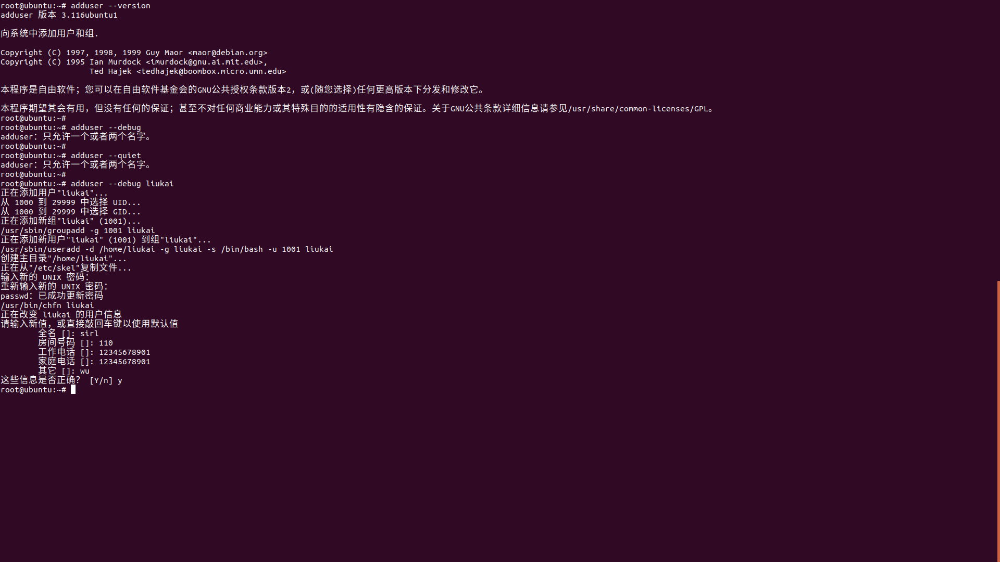

# Linux笔记

​				——Linux命令

## adduser

#### 说明

​		创建用户，并同时创建用户主目录及密码

#### 语法

​		adduser [OPTIONS] 新用户名

|     OPTION      |                             说明                             |
| :-------------: | :----------------------------------------------------------: |
|     --home      | 指定创建主目录的路径，默认在/home下创建用户名同名的目录，这里可以指定；如果同名目录存在，则不再创建 |
|  -v(--version)  |                      显示版本和版权信息                      |
|   -h(--help)    |                       显示指令帮助信息                       |
| --force-badname | 默认在创建用户时会进行/etc/adduser.conf中的正则表达式检查用户名是否合法，如果想使用弱检查，则使用这个选项，如果不想检查，可以将/etc/adduser.conf中相关选项屏蔽 |
|     --debug     |                         打印错误信息                         |
|   -q(--quiet)   |                      打印警告和错误信息                      |

