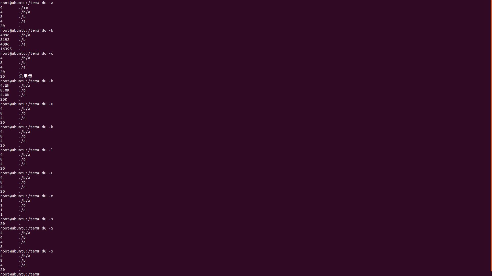

# Linux笔记

​				——Linux命令

## du

#### 说明

​		显示目前在Linux系统上的文件系统的磁盘使用情况统计(用于查看文件和目录磁盘使用空间)

#### 语法

​		du  Option 文件

| Option |                          说明                          |
| :----: | :----------------------------------------------------: |
|   -a   |            显示所有文件的大小，不只是子目录            |
|   -b   |              以 Bytes的容量显示各文件大小              |
|   -c   |          显示完所有参数后再显示这些参数的总计          |
|   -k   |             以 KBytes的容量显示各文件大小              |
|   -h   | 以人们较易阅读的 GBytes, MBytes, KBytes 等格式自行显示 |
|   -H   |       -h参数相同，但是K，M，G是以1000为换算单位        |
|   -m   |             以 MBytes的容量显示各文件大小              |
|   -s   |                  对每个参数只显示总和                  |
|   -S   |      单独报告每一个目录的大小，不包括子目录的大小      |
|   -D   |              显示指定符号链接的源文件大小              |
|   -l   |                 重复计算硬件链接的文件                 |
|   -L   |          显示选项中所指定符号链接的源文件大小          |

###### 注：df和du都是查看磁盘使用情况，当删除文件的时候，并不是立马消失，而是当所有程序都不用的时候，才会根据OS规则进行删除，df可以看到删除文件，而du看不到删除文件，所以df比du更精确，当系统彻底删除文件后，du和df相同