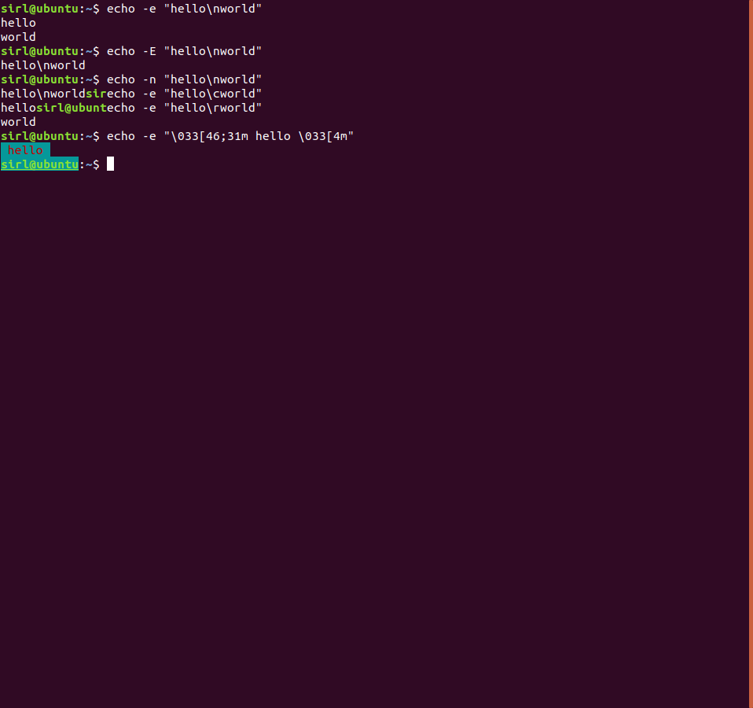

# Linux笔记

​				——Linux命令

## echo

#### 说明

​		用于输出指定字符串

#### 语法

​		echo [Option] 字符串

​		echo "hello world" > 1.txt 输出字符串到指定文件

| Option |                    说明                    |
| :----: | :----------------------------------------: |
|   -n   | 不在末尾输出换行符，默认会在末尾输出换行符 |
|   -e   |               启用反斜杠转义               |
|   -E   |               禁用反斜杠转义               |

#### 转义符

| 转义符 |              说明              |
| :----: | :----------------------------: |
|   \\   |           输出反斜杠           |
|   \a   |         发出声音的响铃         |
|   \b   |         \b前一格不输出         |
|   \c   |       \c后面的字符s删除        |
|   \e   |       控制字体和背景颜色       |
|   \f   | 换行，且光标在换行后原来的地方 |
|   \n   |              换行              |
|   \r   |        \r前面的字符删除        |
|   \t   |             制表符             |
|   \v   |           垂直制表符           |

#### 输出颜色

​		语法：echo -e "\033[字体背景颜色;字体颜色m字符串\033[0m"

```java
//输出带颜色的字体
echo -e "\033[30m 黑色字 \033[0m"
echo -e "\033[31m 红色字 \033[0m"
echo -e "\033[32m 绿色字 \033[0m"
echo -e "\033[33m 黄色字 \033[0m"
echo -e "\033[34m 蓝色字 \033[0m"
echo -e "\033[35m 紫色字 \033[0m"
echo -e "\033[36m 天蓝字 \033[0m"
echo -e "\033[37m 白色字 \033[0m"

//输出带背景颜色的字体
echo -e "\033[40;37m 黑底白字 \033[0m"
echo -e "\033[41;37m 红底白字 \033[0m"
echo -e "\033[42;37m 绿底白字 \033[0m"
echo -e "\033[43;37m 黄底白字 \033[0m"
echo -e "\033[44;37m 蓝底白字 \033[0m"
echo -e "\033[45;37m 紫底白字 \033[0m"
echo -e "\033[46;37m 天蓝底白字 \033[0m"
echo -e "\033[47;30m 白底黑字 \033[0m"

//其他属性
\33[0m 关闭所有属性
\33[1m 设置高亮度
\33[4m 下划线
\33[5m 闪烁
\33[7m 反显
\33[8m 消隐
\33[30m — \33[37m 设置前景色
\33[40m — \33[47m 设置背景色
\33[nA 光标上移n行
\33[nB 光标下移n行
\33[nC 光标右移n行
\33[nD 光标左移n行
\33[y;xH设置光标位置
\33[2J 清屏
\33[K 清除从光标到行尾的内容
\33[s 保存光标位置
\33[u 恢复光标位置
\33[?25l 隐藏光标
\33[?25h 显示光标
```

