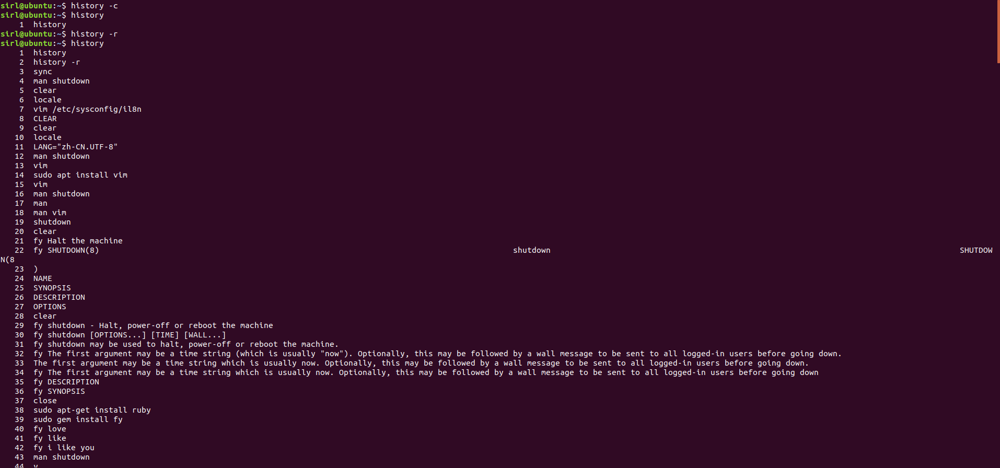

# Linux笔记

​				——Linux命令

## history

#### 说明

​		命令历史

#### 语法

​		history [Option]

| Option |                            说明                             |
| :----: | :---------------------------------------------------------: |
| number |                    显示最近number条纪录                     |
|   -c   | 将目前shell中的所有history命令消除。对命令历史文件没有影响  |
|   -w   | 将本次登录的命令写入命令历史文件中, 默认写入~/.bash_history |
|   -r   |    将命令历史文件中的内容读入到目前shell的history记忆中     |

#### 快捷执行历史命令

|   语法    |                  说明                   |
| :-------: | :-------------------------------------: |
| ! number  |             执行第几条命令              |
| ! command | 从最近的命令查到以command开头的命令执行 |
|    !!     |               执行上一条                |

