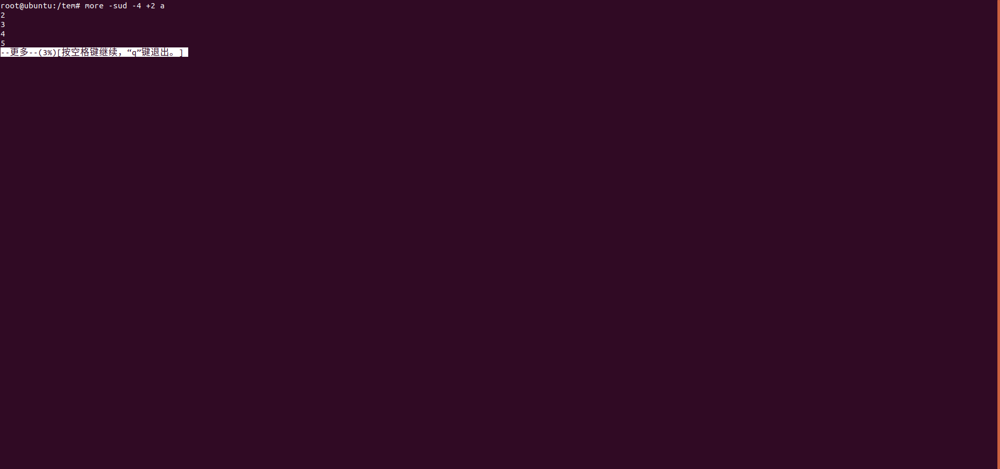

# Linux笔记

​				——Linux命令

## more

#### 说明

​		用于浏览文件，可随意上下翻动

#### 语法

​		more [Option] [文件]

| Option  |                         说明                         |
| :-----: | :--------------------------------------------------: |
| -number |                     显示number行                     |
|   -d    |      让more给用户显示提示信息，而不是扬声器鸣笛      |
|   -l    |    取消遇见特殊字元 ^L（送纸字元）时会暂停的功能     |
|   -f    |  计算行数时，以实际上的行数，而非自动换行过后的行数  |
|   -p    | 不以卷动的方式显示每一页，而是先清除萤幕后再显示内容 |
|   -c    |    跟 -p 相似，不同的是先显示内容再清除其他旧资料    |
|   -s    |              把重复的空行压缩成一个空行              |
|   -u    |                      防止下划线                      |
|   +/    | 在每个文档显示前搜寻该字串，然后从该字串之后开始显示 |
| +number |                 从第number行开始显示                 |

#### 文档操作

|    操作     |               说明               |
| :---------: | :------------------------------: |
|   h or ?    |         显示浏览帮助菜单         |
| 空格键 or z |  显示下面的k行，k取决于屏幕大小  |
|    Enter    |          显示下面的1行           |
|   d or ^Q   | 显示下面的k行，k时当前的卷屏大小 |
|   q or Q    |               退出               |
|      s      |           跳过下面1行            |
|      f      |   跳过下面k行，k取决于屏幕大小   |
|   b or ^B   |   显示上面k行，k取决于屏幕大小   |
|      =      |           显示当前行号           |
|     :f      |       显示当前文件名和行号       |
|     :n      |         显示后面1个文件          |
|     :p      |         显示前面1个文件          |
|      .      |           重复上次命令           |
|      v      |  启动 /usr/bin/vi, 指向 当前行   |
|      /      |            搜索字符串            |
|      n      |         搜索下一个字符串         |
|      ‘      |         搜索上一个字符串         |

