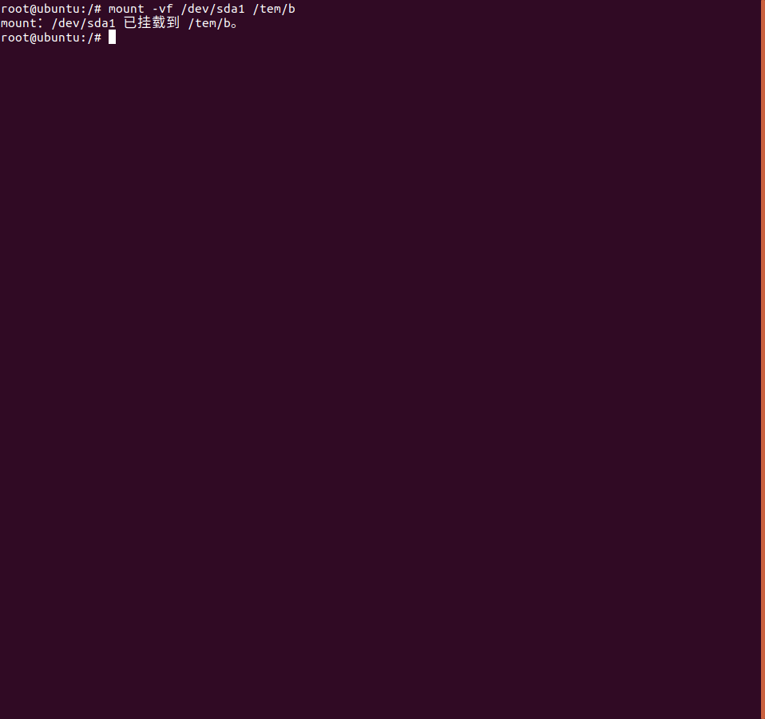

# Linux笔记

​				——Linux命令

## mount

#### 说明

​		用于挂载Linux系统外的文件

#### 语法

​		mount [Option]

| Option |                            说明                             |
| :----: | :---------------------------------------------------------: |
|   -V   |                        显示程序版本                         |
|   -h   |                        显示辅助讯息                         |
|   -v   |               显示较讯息，通常和 -f 用来除错                |
|   -f   | 它会使 mount 并不执行实际挂上的动作，而是模拟整个挂上的过程 |
|   -n   |        取消mount 在挂上后在 /etc/mtab 中写入一笔资料        |

